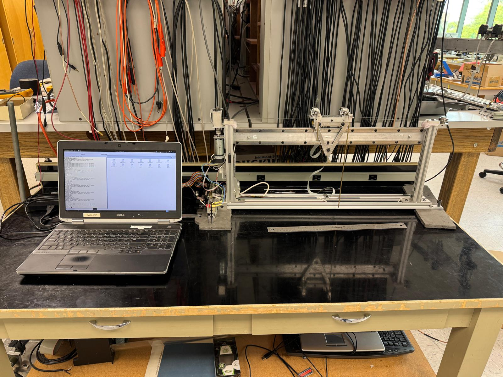

# Single-Inverted-Pendulum
*to Properly observe Derivations download IPYNB file to properly compile

Repository for our ENGR 454 Control Systems Project

Classic inverted Pendulum using modern control theory with Octave.

](Photos/ENGR_454_Single_invpen.jpg)

Video: https://youtu.be/5oP2OeEzNEM

## Description:
This project was done for out Control Systems class, in which we where tasked with developing a control system using the methods learned during the class. The project chosen was to balance an inverted pendulum with the possibility of adding a second pendulum. The system uses a Spartan-3 FPGA for communication with a DC motor, 4 encoders, and 2 hall effect sensors.
The DC motor moves the cart on the track with a string. The encoders provide the angles of the 2 pendulums as well as the position of the cart. One encoder remains unused. The hall effect sensors are intended to shutoff the FPGA when the cart reaches them, preventing the cart from slamming into the end supports.
A laptop, running Octave, uses the "sockets" package to communicate with the FPGA board.

## Setup:
To use the system you need the "ctrlbox.m" file and "pendulum_single.m" files. The "pendulum_single.m" file holds the control method for balancing a the pendulum. The "ctrlbox.m" file interfaces with the FPGA to operate the motor.

## Features:
- Full State Observer
- LQR Control using the Octave "control" package
- Octave

## Control Approach:
Our Project uses state-space feedback controller designed using modern control theory, using:

- Real-time state estimation
- Robust control tuning using matrix-based gain design
- Manual gain tuning

## Future Work:
 - Adding Second Pendulum
 - Removing resonance spots 
 - Recentering the cart after it drifts because of balancing
 - Removing drift while balancing

## Contributors:
Tyler Sing
Andrei Maiorov
